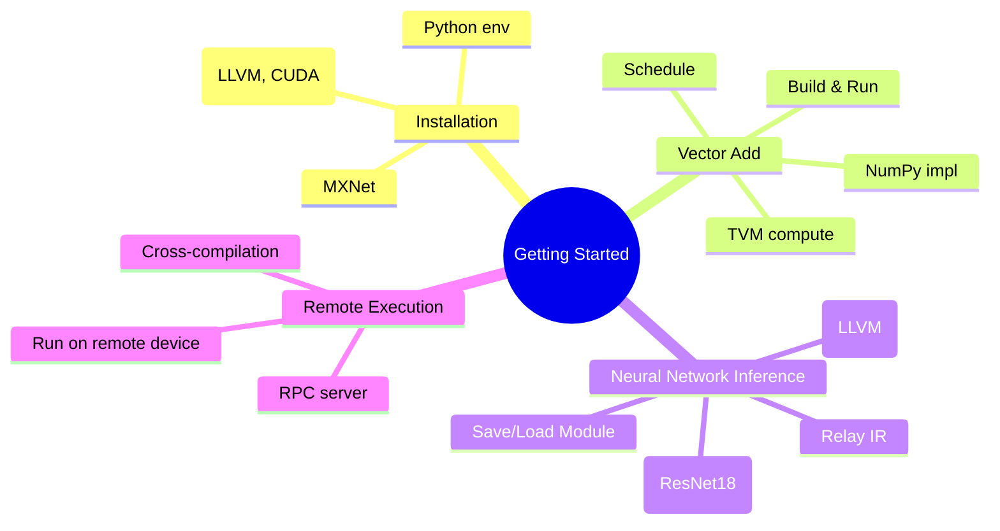
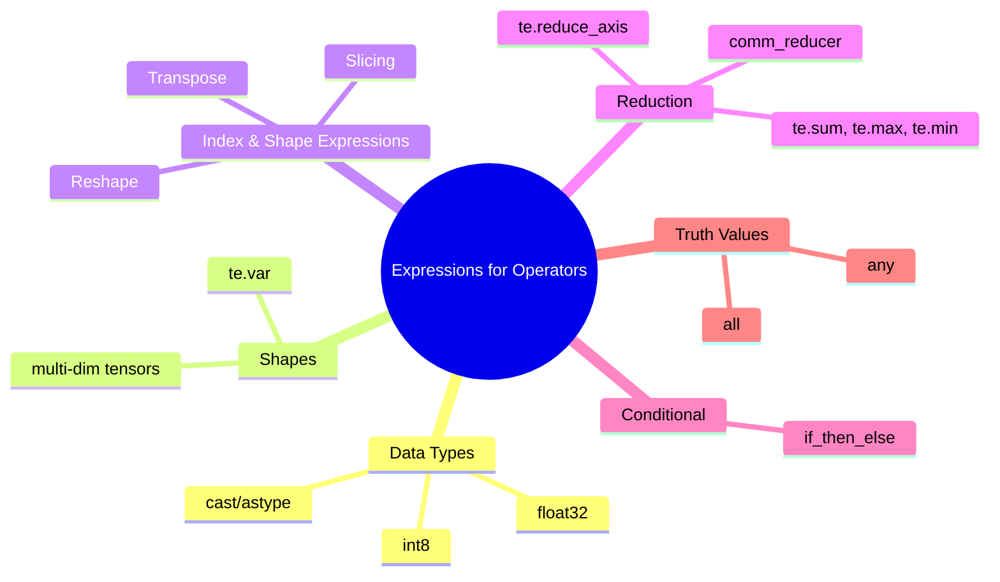
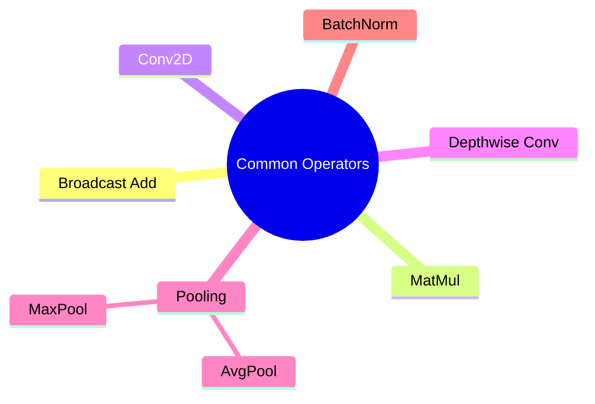
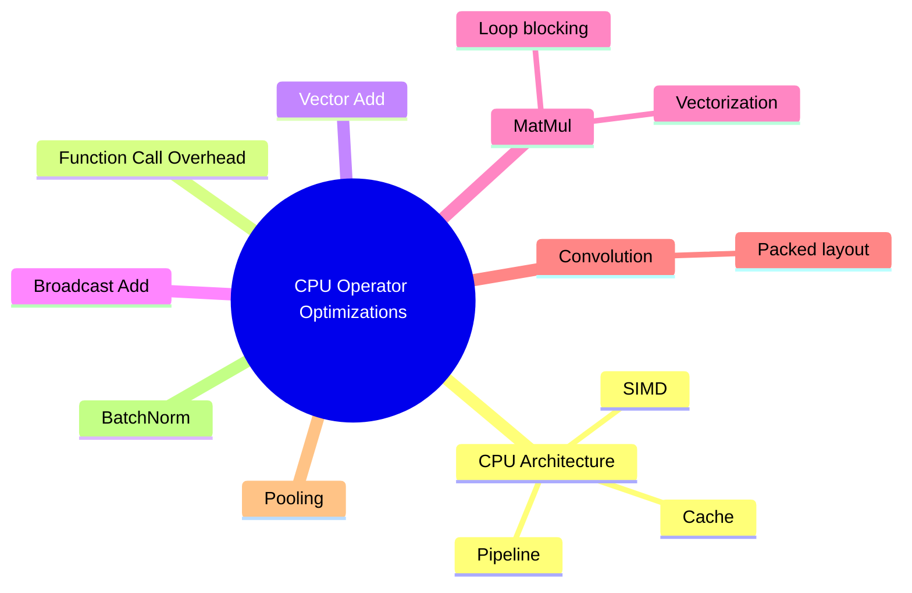
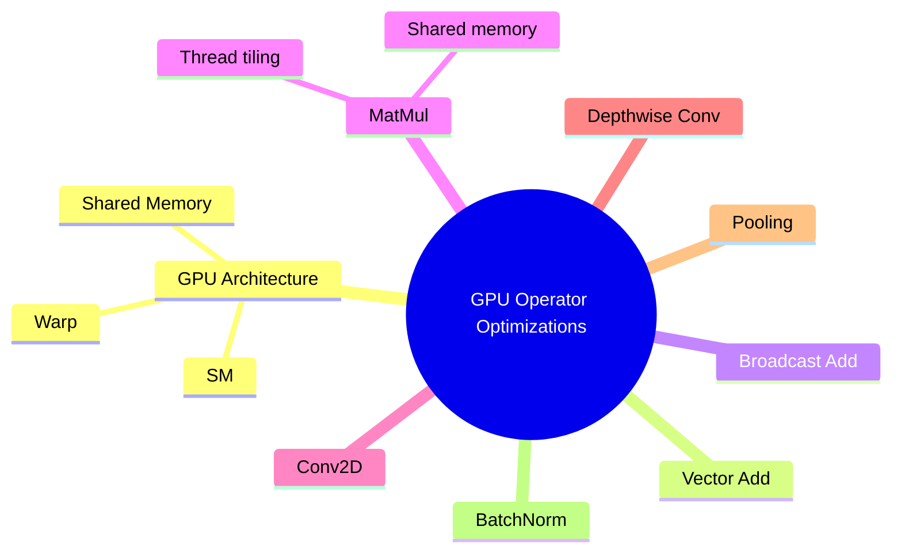

# 环境
- tvm-0.19 + numpy  < 1.24
- ubuntu 22.04
- llvm-15
- 因为依赖mxnet，但是mxnet 2022后不再更新，所以numpy要降级到1.24以前的版本
- TVM 0.20的版本有了比较大的更新，所以这里适配了0.19的版本
	- https://github.com/apache/tvm/issues/17914
- LLVM更高的版本应该也是，但是ubuntu22.04安装llvm-15比较方便，就先用了这个版本


# 编译通过的版本
- https://github.com/Ethan-a2/d2ltvm
- 适配了TVM0.19之后的版本，前4章可以正常编译运行

# 各章思维导图

















# TVM编译

```
sudo apt-get install -y -q \
        git \
        cmake \
        build-essential \
        libtinfo-dev \
        libffi-dev \
        zlib1g-dev \
        llvm-15-dev \
        libclang-15-dev \
        ninja-build

sudo apt install nvidia-cuda-toolkit

git clone --recursive https://github.com/apache/tvm tvm-src
mkdir build; cd build

cp ../cmake/config.cmake .
echo "set(USE_LLVM \"llvm-config-15 --ignore-libllvm --link-static\")" >> config.cmake
sed -i 's/# set(USE_CUDA OFF)/set(USE_CUDA ON)/g' config.cmake
set(USE_GTEST OFF)

cmake ../
cmake --build . --parallel $(nproc)
```


# d2ltvm相关手册
- https://tvm.d2l.ai/d2l-tvm.pdf
- https://github.com/d2l-ai/d2l-tvm
- http://tvm.d2l.ai/d2l-tvm.zip
- https://tvm.d2l.ai/


# 结论
- 提供一种方式：不用手工写底层 CUDA/C++ 内核，而是通过编译器框架统一表达和优化算子/模型。
- 计算与调度分离: 这是TVM（及Halide）的核心思想。计算定义了“做什么”（what to compute），确保正确性；调度定义了“怎么做”（how to compute），影响性能。这种分离使得开发者可以在不改变计算逻辑的情况下，探索不同的底层优化策略，以适应不同的硬件。
- 算子级支持：向量加法、矩阵乘法、卷积、Pooling、BatchNorm 等深度学习常见算子均可用 TVM 定义和优化。
- 自动优化：缓存优化、循环分块 (blocking)、SIMD 向量化、线程并行等。
